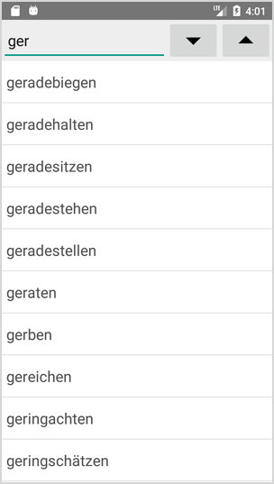
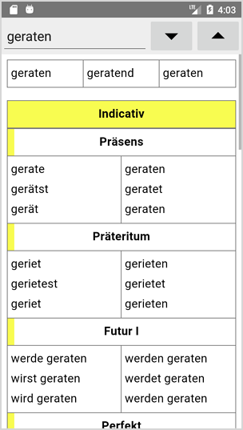
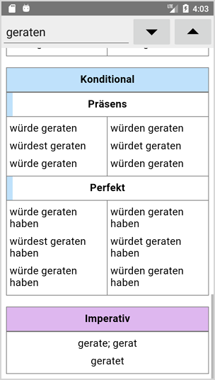

# Verb Conjugator

Presents conjugation forms for a large amount of verbs.

Several applications designed for different languages:

- Spanish (11 800 verbs)
- English (11 100 verbs)
- German (9 000 verbs)
- Italian (7 700 verbs)
- French (6 900 verbs)
- Latin (3 000 verbs)

  
  
  
